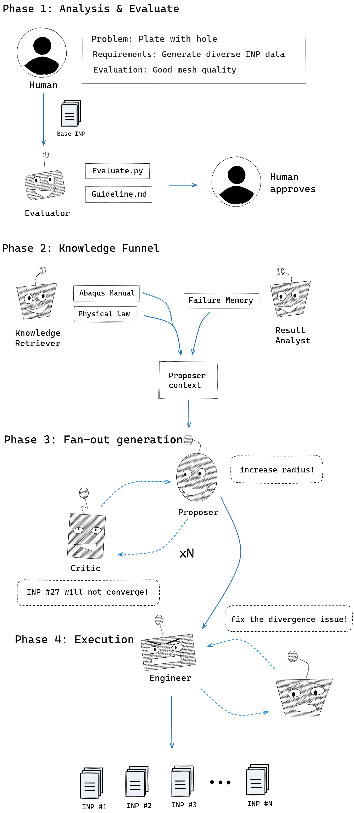

# AgenticSciML for Abaqus

## System pipeline

The codebase implements a fixed pipeline for reading, morphing, and writing Abaqus `.inp` files:

1. **Parser** (`parser.py`) — Reads the `.inp` and splits it into keyword chunks (e.g. *Node, *Element, *Nset, *Elset). Comment lines starting with `**` are skipped.
2. **Manager** (`manager.py`) — Builds an in-memory model from the parsed chunks (nodes, elements, node/element sets, materials, BCs, steps) and exposes the API for reading and updating the model.
3. **Morphing** (`morphing.py`) — **Required.** Applies region-based morphing using a markdown config: assigns node roles (moving / anchor / morphing) from geometric rules, then runs IDW to update nodal coordinates. Uses configs (e.g. `configs/quarter_plate_with_hole_morphing.md`) to define regions and per-region behaviour. Mesh topology (element connectivity, set membership by ID) is preserved; only coordinates change.
4. **Writer** (`writer.py`) — Writes the modified model back to an `.inp` file. NSET/ELSET are always regenerated from the manager (Strategy A); NODE/ELEMENT and other sections are written from the manager when modified or from the original chunk text otherwise.

End-to-end: **input .inp → Parser → Manager → Morphing → Writer → output .inp.** Morphing is a necessary step in the pipeline, not optional.

## Framework Overview: AgenticSciML for Autonomous FEA Dataset Generation

### Phase 1: Analysis & Evaluation Contract
The process begins with the **Human User** defining the problem parameters (e.g., Plate with a hole) and specific requirements. The **Evaluator** agent then performs a "Contractual Setup" to ensure the base model is robust enough for mutation.
* **Guideline Generation**: Produces `Guideline.md` defining unit systems (e.g., SI), mesh safety bounds, and step increment limits.
* **Automated Scoring**: Develops `Evaluate.py` to quantify mesh integrity (Jacobian, Aspect ratio) and physical sanity (Reaction force balance).
* **Human Approval**: The evaluation criteria must be approved by the human user to synchronize the system's "success" definition with research goals.

### Phase 2: The Knowledge Funnel (Proposer Context)
Information from various sources is distilled into a **Proposer Context** to guide intelligent discovery.
* **Knowledge Retriever**: Injects domain expertise from the **Abaqus Manual** and fundamental **Physical Laws**.
* **Dynamic Memory**: Integrates **Failure Memory** (previous divergent logs) provided by the **Result Analyst** to avoid redundant computational waste.
* **Strategy Alignment**: Incorporates Design of Experiments (DOE) and surrogate insights to focus on critical physical regimes.

### Phase 3: Fan-out Generation (The Proposer-Critic Debate)
Instead of blind mutations, this phase employs an iterative **Proposer-Critic Loop** (repeated $XN$ times) to ensure only viable candidates proceed.
* **Proposer Agent**: Suggests geometric mutations (e.g., "increase radius!") or material property shifts.
* **Critic Agent**: Performs "pre-flight checks" on proposed `.inp` modifications. It flags potential issues such as "INP #27 will not converge due to distorted elements".
* **Outcome**: This adversarial interaction ensures that the subsequent execution phase uses high-probability-of-success models.

### Phase 4: Execution & Evolutionary Feedback Loop
The **Engineer** agent implements the final proposals and manages the computational resource.
* **Autonomous Debugging**: If a solver error occurs, the **Engineer** collaborates with a **Debugger** ($XN$ iterations) to fix `.inp` syntax or numerical divergence in real-time.
* **Dataset Production (Fan-out)**: The system generates a massive population of diverse, validated `.inp` files (`INP #1` to `INP #N`).
* **Evolutionary Selection**: The **Result Analyst** ranks datasets based on success/interest and feeds "Success Traits" back into **Phase 2**, triggering the next generation of data evolution.