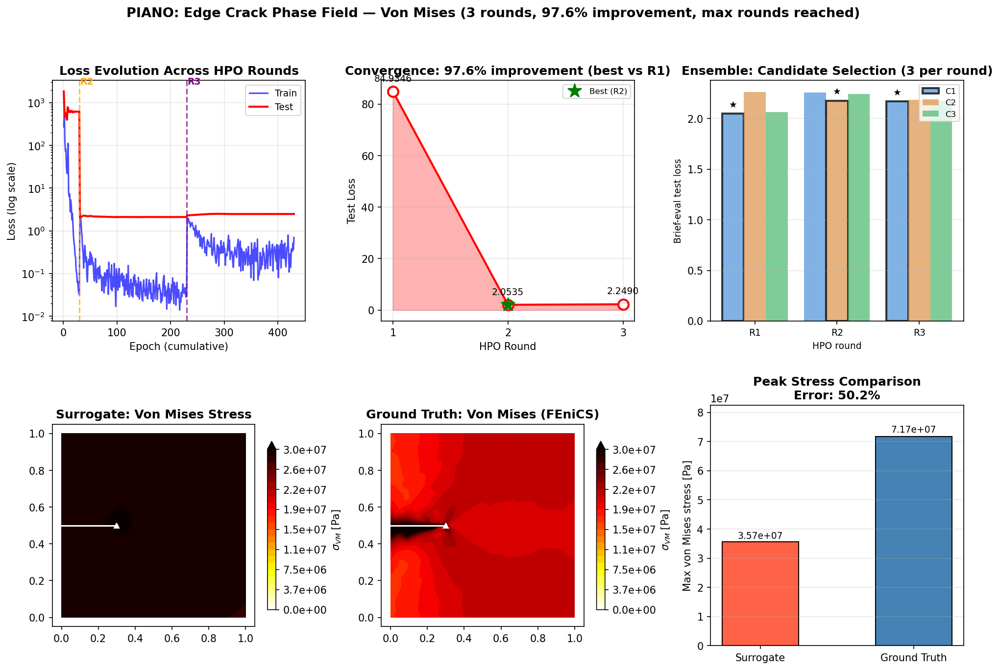

# PIANO

**P**hysics-**I**nformed **A**gentic **N**eural **O**perator

PIANO is a self-improving surrogate framework for computational fracture mechanics. It combines the **Transolver** neural operator with physics-informed losses and a **multi-agent HPO system** that autonomously diagnoses training issues, debates fixes, and proposes new configurations — without manual tuning.

The agentic loop is inspired by [AgenticSciML (Jiang, 2024)](paper/AGENTICSCIML_QJiang.pdf) and implements three key ideas: a structured Critic–Architect debate, best-config selection across rounds, and persistent failure memory fed back to the Architect.

---

## Demo

Edge-crack phase field fracture: 40 FEniCS AT-2 samples, up to 6 agentic HPO rounds, joint prediction of `[u_x, u_y, log1p(σ_vm)]`.



**Top row:** Loss evolution across HPO rounds · HPO convergence per round · Ensemble candidate selection

**Bottom row:** Surrogate von Mises stress · FEniCS ground truth · Peak stress comparison

### Run the demo

```bash
# Generate training data first (requires FEniCS/dolfinx)
python scripts/generate_phase_field_data.py

# Run the agentic loop (mock LLM — no API key needed)
python demo.py

# Options
python demo.py --epochs 40 --rounds 4
python demo.py --output my_demo.png
```

---

## What Makes PIANO Different?

Traditional neural operators require manual hyperparameter tuning. PIANO uses **LLM-based agents** that automatically diagnose training issues, debate solutions, and propose fixes:

```
┌──────────────────────────────────────────────────────────────────────┐
│                      MULTI-AGENT HPO SYSTEM                          │
├──────────────────────────────────────────────────────────────────────┤
│                                                                       │
│          Train from best known config (best-config select)            │
│                              ↓                                        │
│                    ┌─────────────────┐                                │
│                    │  CRITIC AGENT   │ ← failure memory               │
│                    │  Analyzes loss  │                                │
│                    │  curves via LLM │                                │
│                    └────────┬────────┘                                │
│                             ↓                                         │
│              ┌──────────────┴──────────────┐                          │
│              ↓                              ↓                         │
│    ┌─────────────────┐            ┌─────────────────┐                 │
│    │ ARCHITECT AGENT │            │ PHYSICIST AGENT │                 │
│    │ Tunes Transolver│            │ Sequential      │                 │
│    │ • d_model       │            │ physics enabling│                 │
│    │ • n_layers      │            │ energy →        │                 │
│    │ • learning_rate │            │ equilibrium →   │                 │
│    │ • dropout       │            │ traction_free → │                 │
│    │ • slice_num     │            │ → near_tip (PD) │                 │
│    └────────┬────────┘            └────────┬────────┘                 │
│             └──────────────┬───────────────┘                          │
│                            ↓                                          │
│                     Merge & Retrain                                   │
└──────────────────────────────────────────────────────────────────────┘
```

### Three paper-inspired improvements

**Gap 1 — Structured Critic–Architect debate:**
After the Architect proposes a config, the Critic reviews it for feasibility. If the proposal doesn't address the diagnosed issue the Architect revises before training — preventing wasted budget on obviously wrong configs.

**Gap 2 — Best-config selection:**
The Architect always receives the configuration with the best test loss so far, not the most recent one. When a round regresses, the next proposal builds from the best known state.

**Gap 3 — Failure memory:**
Every round appends a plain-text summary `(round, changes, train_loss, test_loss, diagnosis)` to `attempt_history`, passed to the Architect so it never repeats a failed strategy.

---

## The Agents

### HyperparameterCriticAgent
Analyzes loss curves to detect `OVERFITTING`, `UNDERFITTING`, `SLOW_CONVERGENCE`, `LOSS_PLATEAU`, `UNSTABLE_TRAINING`, `GRADIENT_EXPLOSION`. Also runs `review_proposal()` (the debate step) — checks whether an Architect proposal actually addresses the diagnosed issue.

### ArchitectAgent
Proposes Transolver hyperparameters based on the Critic's diagnosis, the best known config, and the full attempt history:

| Concern | Parameters |
|---------|------------|
| Capacity | `d_model`, `n_layers`, `n_heads`, `slice_num` |
| Optimization | `learning_rate`, `optimizer_type`, `scheduler_type` |
| Regularization | `dropout`, `mlp_ratio` |

If hyperparameter changes alone cannot fix the issue (e.g. wrong feature encoding), the Architect sets `CODE_CHANGE_DESCRIPTION` and the EngineerAgent implements the fix via Claude Code CLI before retraining.

### PhysicistAgent
Sequentially enables fracture mechanics loss terms — each only activated once the previous has stabilised:

```
energy → equilibrium → traction_free → near_tip → j_integral
```

| Term | What it enforces |
|------|-----------------|
| `energy` | Strain energy norm consistency |
| `equilibrium` | Nodal force balance residual (label-free) |
| `traction_free` | σ = 0 on crack faces |
| `near_tip` | Peridynamic equilibrium: Σ_j (1−d_ij)² s_ij ê_ij = 0 |
| `j_integral` | Domain J = K_I²/E |

If the physics-to-data loss ratio exceeds 10%, the Physicist halves all active weights to prevent physics from overriding the data signal.

### Supporting Agents
- **ResultAnalystAgent** — observes training curves before proposals (Round 1 of debate)
- **KnowledgeRetrieverAgent** — surfaces relevant KB entries (williams_expansion, xfem_enrichment, etc.) before each round
- **DataAnalystAgent** — pre-training dataset EDA (near-tip density, output skewness)
- **SelectorEnsembleAgent** — 3-LLM majority vote for candidate config selection
- **EngineerAgent** — implements source-code changes via Claude Code CLI
- **DebuggerAgent** — diagnoses EngineerAgent failures
- **AdaptiveProposerAgent** — targets weak / high-uncertainty regions for active learning
- **MeshStrategyAgent** — r/h-refinement resolution decisions
- **BudgetAgent** — decides when to collect more FEM data vs. stop

---

## Neural Architecture: Transolver

Physics-Attention transformer operator. Learns mappings from parameters to physical fields on unstructured meshes via sliced attention over geometry-aware tokens.

**Singularity-aware coordinate enrichment:**
Raw `(x, y)` are enriched with polar features relative to the crack tip:
```
[x, y,  r,  log(r),  sin(θ),  cos(θ),  sin(θ/2),  cos(θ/2)]
```
`log(r)` is key since `log(σ) ≈ log(K_I) − 0.5·log(r)` near the tip. `sin(θ/2)` / `cos(θ/2)` encode the mode-I displacement discontinuity.

---

## Physics-Informed Training

### Loss
```
L_total = L_MSE + energy × L_energy + equilibrium × L_equilibrium
        + traction_free × L_bc + near_tip × L_pd + j_integral × L_J
```

| Term | Formula | Labels |
|------|---------|--------|
| `L_energy` | Strain energy of prediction error: `Σ_e (ε_err^T C ε_err A_e) / Σ A_e` | Yes |
| `L_equilibrium` | Nodal force residual: `‖Σ_e B_e^T C B_e u_e A_e‖² / N` | No |
| `L_bc` | Traction-free on crack faces, normalised by `K_I²/(2π·r_min)` | No |
| `L_pd` | Bond-based: `Σ_j (1−d_ij)² s_ij ê_ij = 0` at every node | No |
| `L_J` | Domain J = K_I²/E (plane stress) | Yes |

### Tip-Weighted MSE
Nodes near the crack tip get higher loss weight: `w_i = 1 + tip_weight / r_i`, normalized so `mean(w) = 1`.

---

## Project Structure

```
piano/
├── agents/                      # LLM-based agents
│   ├── base.py                 # BaseAgent, AgentContext
│   ├── roles/
│   │   ├── hyperparameter_critic.py
│   │   ├── architect.py
│   │   ├── physicist.py
│   │   ├── result_analyst.py
│   │   ├── engineer.py
│   │   ├── debugger.py
│   │   ├── knowledge_retriever.py
│   │   ├── data_analyst.py
│   │   ├── selector_ensemble.py
│   │   ├── adaptive_proposer.py
│   │   ├── mesh_strategy.py
│   │   └── budget.py
│   └── llm/                    # Providers: Anthropic (Claude), OpenAI
│
├── surrogate/                   # Neural operator training
│   ├── transolver.py           # Transolver (Physics-Attention)
│   ├── trainer.py              # Training loop (PINO-enabled)
│   ├── agentic_trainer.py      # Multi-agent HPO wrapper
│   ├── ensemble.py             # Bootstrap ensemble
│   ├── evaluator.py            # Uncertainty analysis + active learning
│   ├── error_analysis.py       # Spatial error + hotspot detection
│   ├── acquisition.py          # Acquisition functions (US, EI, QBC)
│   └── base.py                 # TransolverConfig, CrackConfig, EnsembleConfig
│
├── physics/                     # Physics-informed losses
│   ├── pino_loss.py            # Equilibrium + energy-norm (Delaunay cached)
│   ├── crack_pino_loss.py      # K_I consistency, traction-free BC, J-integral
│   ├── peridynamic_loss.py     # Bond-based PD equilibrium residual
│   └── variational_loss.py     # AT-2 degraded strain energy (label-free)
│
├── data/                        # Dataset utilities
│   ├── dataset.py              # FEMDataset, FEMSample
│   ├── phase_field_generator.py  # FEniCS AT-2 data generation
│   └── loader.py
│
├── solvers/                     # FEM solvers
│   ├── fenics_phase_field.py   # FEniCS AT-2 staggered scheme
│   └── mfem_solver.py          # MFEM linear elasticity (crack meshes)
│
├── mesh/                        # Mesh handling
│   ├── fenics_manager.py
│   ├── gmsh_generator.py
│   └── mfem_manager.py
│
├── geometry/                    # Crack geometry
│   ├── crack.py                # EdgeCrack, CenterCrack
│   └── notch.py
│
└── orchestration/               # Active learning loop
    └── adaptive.py             # AdaptiveOrchestrator (FEniCS phase-field)

knowledge_base/                  # KB entries for KnowledgeRetrieverAgent
scripts/
├── generate_phase_field_data.py # Generate FEniCS training data
└── generate_crack_meshes.py    # Generate MFEM crack meshes
tests/
├── test_surrogate.py           # FEMDataset, Trainer, Evaluator, Acquisition, PhaseField
└── test_agents.py              # All agent parse/heuristic logic
demo.py                          # End-to-end agentic loop → agentic_phase_field_demo.png
```

---

## Configuration: TransolverConfig

| Parameter | Default | Tuned by | Description |
|-----------|---------|----------|-------------|
| `d_model` | 256 | Architect | Hidden dimension |
| `n_layers` | 6 | Architect | Transformer layers |
| `n_heads` | 8 | Architect | Attention heads (must divide d_model) |
| `slice_num` | 32 | Architect | Physics-attention slices |
| `dropout` | 0.0 | Architect | Dropout rate |
| `learning_rate` | 1e-3 | Architect | Learning rate |
| `optimizer_type` | `adamw` | Architect | Optimizer |
| `scheduler_type` | `plateau` | Architect | LR scheduler |
| `energy` | 0.0 | Physicist | Strain energy loss weight |
| `equilibrium` | 0.0 | Physicist | Equilibrium residual weight |
| `traction_free` | 0.0 | Physicist | Crack face BC weight |
| `near_tip` | 0.0 | Physicist | Peridynamic equilibrium weight |
| `j_integral` | 0.0 | Physicist | J-integral consistency weight |
| `tip_weight` | 0.0 | Fixed | Crack-tip loss amplification |

---

## Installation

```bash
git clone https://github.com/your-username/PIANO.git
cd PIANO
pip install -e .
```

**FEniCS (dolfinx)** is required for generating new training data. The demo runs on pre-generated data in `phase_field_data/` and does not require FEniCS.

**LLM provider:** Set `ANTHROPIC_API_KEY` in your environment to use real Claude agents. Without it, `MockLLMProvider` in `demo.py` is used automatically.

---

## References

- Jiang (2024): *AgenticSciML* — evolutionary multi-agent system for SciML
- Wu et al. (2024): *Transolver: A Fast Transformer Solver for PDEs on General Geometries*, ICML 2024
- Li et al. (2024): *Physics-Informed Neural Operator for Learning Partial Differential Equations*
- Silling (2000): *Reformulation of elasticity theory for discontinuities and long-range forces*, J. Mech. Phys. Solids
- Bourdin et al. (2000): *Numerical experiments in revisited brittle fracture*, J. Mech. Phys. Solids
- Goswami et al. (2022): *A physics-informed variational DeepONet for weakly-supervised fracture*
- [FEniCS/dolfinx](https://fenicsproject.org/) — phase field fracture solver

---

## License

BSD 3-Clause. See [LICENSE](LICENSE) for details.

## Authors

- Hyun-Young Nam (hyun_young_nam@brown.edu)
- Qile Jiang (qile_jiang@brown.edu)
