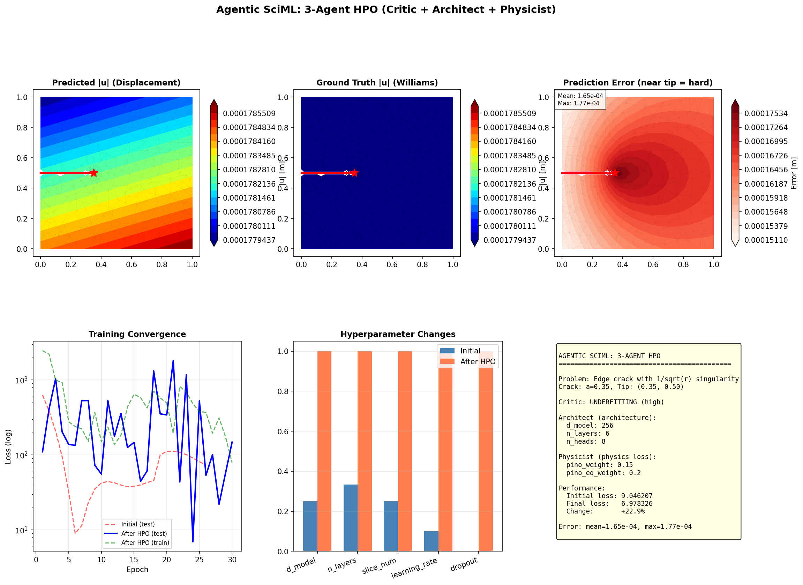

# PIANO

**P**hysics-**I**nformed **A**gentic **N**eural **O**perator

PIANO is a self-improving surrogate framework for computational mechanics. It combines a **Transolver neural operator** with **physics-informed loss** and an **autonomous 3-agent HPO system** to learn FEM field predictions with minimal ground-truth data.

---

## What Makes PIANO Different?

Traditional neural operators require manual hyperparameter tuning. PIANO uses **LLM-based agents** that automatically diagnose training issues and propose fixes:

```
┌─────────────────────────────────────────────────────────────────────┐
│                     3-AGENT HPO SYSTEM                              │
├─────────────────────────────────────────────────────────────────────┤
│                                                                     │
│                         Train Model                                 │
│                              ↓                                      │
│                    ┌─────────────────┐                              │
│                    │  CRITIC AGENT   │                              │
│                    │  Analyzes loss  │                              │
│                    │  curves, detects│                              │
│                    │  issues         │                              │
│                    └────────┬────────┘                              │
│                             ↓                                       │
│              ┌──────────────┴──────────────┐                        │
│              ↓                              ↓                       │
│    ┌─────────────────┐            ┌─────────────────┐               │
│    │ ARCHITECT AGENT │            │ PHYSICIST AGENT │               │
│    │                 │            │                 │               │
│    │ • d_model       │            │ • pino_weight   │               │
│    │ • n_layers      │            │ • pino_eq_weight│               │
│    │ • learning_rate │            │ • Singularity   │               │
│    │ • optimizer     │            │   handling      │               │
│    │ • dropout       │            │ • PDE residual  │               │
│    └────────┬────────┘            └────────┬────────┘               │
│             └──────────────┬───────────────┘                        │
│                            ↓                                        │
│                     Merge Proposals                                 │
│                            ↓                                        │
│                    Retrain & Repeat                                 │
└─────────────────────────────────────────────────────────────────────┘
```

**Why 3 agents?** Physics-informed learning has two distinct concerns:
- **Architecture tuning** (capacity, optimization) — handled by Architect
- **Physics enforcement** (PDE constraints, singularities) — handled by Physicist

Separating these allows each agent to be an expert in its domain.

---

## Example: Crack Tip Singularity

PIANO focuses on **fracture mechanics** — specifically edge cracks with 1/√r stress singularities. This is challenging for neural operators and showcases the value of agentic HPO.

### Demo Visualization



**Row 1:** Displacement field prediction on crack mesh
- Predicted |u|, Ground truth (Williams expansion), Error field
- Red star marks crack tip where singularity causes highest error

**Row 2:** Agentic HPO analysis
- Training loss curves (before/after optimization)
- Hyperparameter changes from Architect and Physicist
- Summary with improvement metrics

### Run the Demo

```bash
# Generate the visualization above
python tests/test_agentic_sciml.py --n-samples 8 --epochs 30

# Run all tests
pytest tests/test_agentic_sciml.py -v
```

---

## The Agents

### 1. HyperparameterCriticAgent
**Role:** Training diagnostician

Analyzes loss curves to detect:
- `OVERFITTING` — test loss increasing while train decreases
- `UNDERFITTING` — both losses high, model not learning
- `SLOW_CONVERGENCE` — learning rate too low
- `LOSS_PLATEAU` — no improvement for many epochs
- `GRADIENT_EXPLOSION` — NaN values detected

### 2. ArchitectAgent
**Role:** Neural network architect

Proposes changes to:
| Category | Parameters |
|----------|------------|
| Architecture | d_model, n_layers, n_heads, slice_num |
| Optimization | learning_rate, optimizer_type, scheduler_type |
| Regularization | dropout, weight_decay |
| Activation | gelu, silu, relu |

### 3. PhysicistAgent
**Role:** Physics loss specialist

Proposes changes to:
| Category | Parameters |
|----------|------------|
| Energy loss | pino_weight (strain energy consistency) |
| Equilibrium | pino_eq_weight (force balance residual) |
| Material | pino_E, pino_nu (constitutive law) |

Understands:
- Crack tip singularities (1/√r behavior)
- When physics constraints help vs. hurt learning
- Balance between data-driven and physics-informed loss

---

## Quick Start

### Installation

```bash
git clone https://github.com/your-username/PIANO.git
cd PIANO
pip install -e ".[all]"
```

### Generate Crack Meshes

```bash
python scripts/generate_crack_meshes.py --n-samples 10 --output-dir crack_data
```

This creates meshes with:
- Varying crack length (a/W = 0.2 to 0.5)
- Varying crack angle (-15° to +15°)
- Refined mesh near crack tip

### Train with Agentic HPO

```python
from piano.surrogate.agentic_trainer import (
    AgenticSurrogateTrainer,
    AgenticTrainingConfig,
)
from piano.surrogate.base import TransolverConfig

# Configure agentic training
config = AgenticTrainingConfig(
    base_config=TransolverConfig(
        d_model=64,        # Initial (small)
        n_layers=2,        # Initial (shallow)
        epochs=100,
    ),
    max_hpo_rounds=3,      # Max optimization rounds
    trigger_threshold=0.1, # Trigger HPO if loss > this
    use_physicist=True,    # Enable PhysicistAgent
    problem_type="crack",  # Physics problem type
    has_singularity=True,  # Has stress singularity
)

# Create trainer with LLM provider
trainer = AgenticSurrogateTrainer(config, llm_provider=your_provider)

# Train — agents automatically optimize if needed
result = trainer.train(parameters, coordinates, outputs)

print(f"HPO rounds: {result.n_hpo_rounds}")
print(f"Improvement: {result.improvement_percent:.1f}%")
```

---

## Project Structure

```
piano/
├── surrogate/                   # Neural operator training
│   ├── transolver.py           # Transolver (Physics-Attention)
│   ├── trainer.py              # Standard training loop
│   ├── agentic_trainer.py      # 3-agent HPO wrapper
│   ├── pino_loss.py            # Physics-informed loss
│   ├── ensemble.py             # Ensemble for uncertainty
│   └── base.py                 # TransolverConfig
│
├── agents/                      # LLM-based agents
│   ├── base.py                 # BaseAgent, AgentContext
│   ├── roles/
│   │   ├── hyperparameter_critic.py  # Diagnoses training issues
│   │   ├── architect.py              # Architecture/optimizer tuning
│   │   ├── physicist.py              # Physics loss tuning
│   │   └── adaptive_proposer.py      # Active learning (future)
│   └── llm/                    # LLM providers (OpenAI, Anthropic)
│
├── geometry/                    # Mesh generation
│   └── crack.py                # Crack geometry (edge, center)
│
├── mesh/                        # Mesh handling
│   └── mfem_manager.py         # MFEM mesh wrapper
│
├── solvers/                     # FEM solvers
│   └── mfem_solver.py          # PyMFEM linear-elasticity
│
└── orchestration/               # Workflow control
    └── adaptive.py             # Active learning loop
```

---

## Physics-Informed Loss (PINO)

The loss combines data-driven and physics-informed terms:

```
L_total = L_MSE + pino_weight × L_energy + pino_eq_weight × L_equilibrium
```

### Equilibrium Residual (Label-Free)
Enforces force balance: div(σ) = 0
```
L_eq = ‖R‖² / N,  where R_i = Σ_e (B_e^T C B_e u_pred A_e)
```

### Energy-Norm Error (With Labels)
Physics-weighted H1 seminorm:
```
L_energy = Σ_e (ε_err^T C ε_err A_e) / Σ_e A_e
```

Both terms use Delaunay triangulation + vectorized B-matrix assembly. Fully differentiable via PyTorch `scatter_add_`.

---

## Configuration

### TransolverConfig

| Parameter | Default | Description |
|-----------|---------|-------------|
| `d_model` | 256 | Hidden dimension |
| `n_layers` | 6 | Transformer layers |
| `n_heads` | 8 | Attention heads |
| `slice_num` | 32 | Physics-attention slices |
| `dropout` | 0.0 | Dropout rate |
| `learning_rate` | 1e-3 | Learning rate |
| `optimizer_type` | "adamw" | Optimizer (adamw, adam, sgd) |
| `scheduler_type` | "plateau" | Scheduler (plateau, cosine, none) |
| `activation` | "gelu" | Activation (gelu, silu, relu) |
| `pino_weight` | 0.1 | Energy-norm loss weight |
| `pino_eq_weight` | 0.1 | Equilibrium loss weight |

### AgenticTrainingConfig

| Parameter | Default | Description |
|-----------|---------|-------------|
| `max_hpo_rounds` | 3 | Maximum HPO iterations |
| `trigger_threshold` | 0.1 | Loss threshold to trigger HPO |
| `use_physicist` | True | Enable PhysicistAgent |
| `problem_type` | "crack" | Physics problem type |
| `has_singularity` | True | Problem has stress singularity |

---

## References

- Wu et al. (2024): *Transolver: A Fast Transformer Solver for PDEs on General Geometries*, ICML 2024
- Li et al. (2024): *Physics-Informed Neural Operator for Learning Partial Differential Equations*
- Williams (1957): *On the Stress Distribution at the Base of a Stationary Crack*
- [MFEM](https://mfem.org/) — Modular Finite Element Methods library

---

## License

BSD 3-Clause. See [LICENSE](LICENSE) for details.

## Authors

- Hyun-Young Nam (hyun_young_nam@brown.edu)
- Qile Jiang (qile_jiang@brown.edu)
