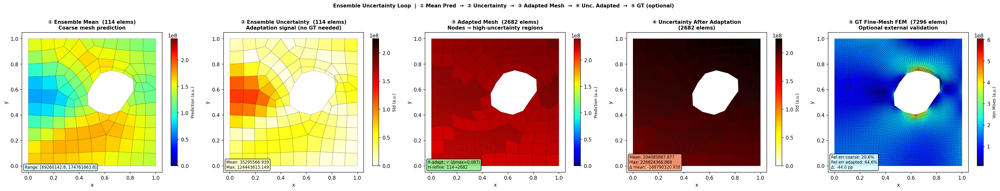

# meshforge

**meshforge** is an adaptive active learning framework for efficient FEM dataset generation. It uses a **Transolver** surrogate model with **informative sampling** to intelligently guide data collection, focusing computational resources on regions where the surrogate model is weak.

Generate high-quality training data for scientific machine learning with minimal FEM simulations through autonomous active learning.

---

## Table of Contents

- [Key Features](#key-features)
- [Core Concept: Informative Sampling](#core-concept-informative-sampling)
- [Quick Start](#quick-start)
- [Installation](#installation)
- [Active Learning Loop](#active-learning-loop)
- [Acquisition Functions](#acquisition-functions)
- [Usage Examples](#usage-examples)
- [Architecture](#architecture)
- [R-Adaptivity](#r-adaptivity-error-driven-mesh-adaptation)
- [H-Adaptivity](#h-adaptivity-selective-element-refinement)
- [Configuration](#configuration)
- [API Reference](#api-reference)

---

## Key Features

- **PyMFEM FEM Solver**: Real linear-elasticity FEM ground truth via PCG + Gauss-Seidel smoother — no analytical approximations
- **Transolver Surrogate**: Physics-Attention (slice-attention) neural operator for unstructured meshes; reduces O(N²) to O(S² + NS)
- **Active Learning Loop**: Autonomous iteration between data generation and model training with intelligent stopping criteria
- **Informative Sampling**: Acquisition functions (Uncertainty, Expected Improvement, Query-by-Committee) prioritize samples that maximize model improvement
- **R-Adaptivity**: Error-driven mesh adaptation using TMOP — nodes cluster in high-error regions to improve surrogate accuracy
- **H-Adaptivity**: Selective element refinement via MFEM non-conforming AMR
- **Adaptive Budget**: Dynamically adjusts sampling rate based on convergence progress
- **MFEM Native**: Works directly with MFEM mesh format and TMOP optimization
- **Convergence Monitoring**: Multiple stopping criteria (error threshold, patience, budget, diminishing returns)

---

## Core Concept: Informative Sampling

Traditional approaches sample the parameter space uniformly. **Informative sampling** uses the surrogate model's uncertainty to identify where new simulations would be most valuable:

```
Traditional Sampling:          Active Learning:
┌───────────────────┐         ┌───────────────────┐
│ • • • • • • • • • │         │ •       •     •   │
│ • • • • • • • • • │         │           ••••••  │ ← High uncertainty region
│ • • • • • • • • • │   vs    │ •    ••••••••••   │   gets more samples
│ • • • • • • • • • │         │       •••••••     │
│ • • • • • • • • • │         │ •   •       •     │
└───────────────────┘         └───────────────────┘
  100 samples                   40 samples, same accuracy
```

The acquisition function quantifies "informativeness" — regions with high ensemble disagreement, high expected improvement, or high uncertainty receive more samples.

---

## Quick Start

### Training the Transolver Surrogate

```bash
# Generate mesh samples (requires gmsh >= 4.11)
python samples/generate_samples.py --n 200 --output train01           # single-hole plates
python samples/generate_two_hole_samples.py --n 200 --output train02  # two-hole plates

# Run the uncertainty-loop visualization (trains ensemble on-the-fly from both dirs)
python tests/test_transolver.py --samples-dirs train01 train02 --model-dir outputs/surrogate

# Compare uncertainty across a few samples
python tests/test_transolver.py --samples-dirs train01 train02 --model-dir outputs/surrogate --compare
```

### Using the Framework Programmatically

```python
from meshforge import AdaptiveOrchestrator, AdaptiveConfig

config = AdaptiveConfig(
    base_mesh_path="meshes/plate_with_hole.mesh",
    output_dir="./output",
    parameter_names=["E", "nu", "load"],
    parameter_bounds={
        "E": (150e9, 250e9),
        "nu": (0.25, 0.35),
        "load": (80e6, 120e6),   # Pa (80–120 MPa uniaxial traction)
    },
    initial_samples=20,
    samples_per_iteration=10,
    max_iterations=15,
    acquisition_strategy="uncertainty",
    convergence_threshold=0.05,
    convergence_patience=3,
    max_samples=200,
    use_ensemble=True,
    n_ensemble=5,
)

orchestrator = AdaptiveOrchestrator(config)
result = orchestrator.run()

print(f"Converged: {result.stopping_criterion.name}")
print(f"Total samples: {result.total_samples}")
print(f"Error reduction: {result.error_reduction_percent:.1f}%")
```

---

## Installation

### From Source

```bash
git clone https://github.com/your-repo/meshforge.git
cd meshforge
pip install -e ".[all]"
```

### Dependencies

```bash
# Core + surrogate model support
pip install -e ".[surrogate]"

# With MFEM solver
pip install -e ".[mfem]"

# Full installation
pip install -e ".[all]"
```

### Prerequisites

- Python 3.9+
- PyTorch (for Transolver surrogate)
- PyMFEM — required for FEM simulation ground truth and mesh format conversion
- gmsh >= 4.11.0 — required for mesh generation (bundles Mesa; no system libGLU needed on most platforms)
- scipy (for acquisition functions)

**Headless Linux / WSL2 note**: if `import gmsh` fails with `libGLU.so.1: cannot open shared object file`, run:
```bash
sudo apt-get install -y libglu1-mesa
```
meshio is **not** required — `.msh` → `.mesh` conversion uses PyMFEM's native Gmsh reader.

---

## FEM Solver

Ground-truth stress fields are computed with **PyMFEM linear elasticity** — no analytical approximations.

### Problem Setup: Plate-with-Hole (Uniaxial Tension)

The domain is a unit-square plate `[0,1]×[0,1]` with one or two blob-shaped holes. Boundary conditions:

| Boundary | Tag | Type | Value |
|----------|-----|------|-------|
| Left (x=0) | 4 | Symmetry (roller) | u_x = 0 — prevents x-translation |
| Bottom (y=0) | 1 | Symmetry (roller) | u_y = 0 — prevents y-translation/rotation |
| Right (x=1) | 2 | Neumann traction | t = [σ₀, 0] — uniaxial load (80–120 MPa) |
| Top (y=1) | 3 | Free | zero traction (natural Neumann) |
| Hole surface | 5 / 6 | Free | traction-free |

Boundary tags are written at mesh generation time by PyMFEM's native Gmsh reader, which maps gmsh physical curves directly to MFEM boundary attributes. The previous meshio-based conversion is removed — it silently dropped 4 of 5 boundary groups, causing the FEM solver to receive a zero load vector.

### Solver Details

- **Formulation**: Galerkin FEM with `ElasticityIntegrator` (Lamé equations: ∇·σ=0)
- **Elements**: `H1_FECollection`, order 1 (bilinear), vector-valued displacement field
- **Linear solver**: PCG, 500 max iterations, 1e-12 tolerance
- **Preconditioner**: Gauss-Seidel smoother
- **Post-processing**: Per-element von Mises stress from displacement gradient at element centres

```python
from meshforge.mesh.mfem_manager import MFEMManager
from meshforge.solvers.mfem_solver import MFEMSolver
from meshforge.solvers.base import (
    PhysicsConfig, PhysicsType, MaterialProperties,
    BoundaryCondition, BoundaryConditionType,
)
import numpy as np, tempfile

manager = MFEMManager("train01/sample_000.mesh")

physics = PhysicsConfig(
    physics_type=PhysicsType.LINEAR_ELASTICITY,
    material=MaterialProperties(E=200e9, nu=0.3),
    boundary_conditions=[
        BoundaryCondition(BoundaryConditionType.SYMMETRY, boundary_id=4, direction=0),  # u_x=0 on left
        BoundaryCondition(BoundaryConditionType.SYMMETRY, boundary_id=1, direction=1),  # u_y=0 on bottom
        BoundaryCondition(BoundaryConditionType.TRACTION,  boundary_id=2,
                          value=np.array([100e6, 0.])),  # 100 MPa uniaxial tension
    ],
)

solver = MFEMSolver(order=1)
solver.setup(manager, physics)

with tempfile.TemporaryDirectory() as tmp:
    result = solver.solve(tmp)

vm = result.solution_data['von_mises']
print(f"von Mises range: {vm.min()*1e-6:.1f} .. {vm.max()*1e-6:.1f} MPa")
```

---

## Example Output

Each test run produces a 5-panel uncertainty-driven SciML loop visualization:

| Panel | Content |
|-------|---------|
| ① | Ensemble mean prediction on coarse mesh |
| ② | Ensemble uncertainty (adaptation signal — no GT needed) |
| ③ | R+H adapted mesh (nodes clustered toward high-uncertainty region) |
| ④ | Ensemble uncertainty on adapted mesh |
| ⑤ | Fine-mesh FEM ground truth (optional validation) |



Trained on 400 samples (200 single-hole + 200 double-hole), 500 epochs, 3-member ensemble.  
Coarse rel. error: ~20% · GT peak: ~600 MPa (SCF ≈ 3× applied load at hole boundary)

---

## Active Learning Loop

```
┌─────────────────────────────────────────────────────────────────────┐
│                    ACTIVE LEARNING WORKFLOW                         │
├─────────────────────────────────────────────────────────────────────┤
│                                                                     │
│  1. INITIAL SAMPLING (Latin Hypercube)                              │
│     └─ Generate diverse initial samples for good coverage           │
│                          ↓                                          │
│  2. FEM SIMULATIONS (PyMFEM)                                        │
│     └─ Run linear-elasticity solver for each mesh/parameter config  │
│                          ↓                                          │
│  ┌─────────────────────────────────────────────────────────────────┐│
│  │  ACTIVE LEARNING LOOP                                           ││
│  │                                                                 ││
│  │  3. TRAIN Transolver SURROGATE                                  ││
│  │     └─ Physics-Attention operator on unstructured mesh coords   ││
│  │                          ↓                                      ││
│  │  4. EVALUATE VIA ENSEMBLE UNCERTAINTY (no GT needed)             ││
│  │     ├─ Predict on candidate parameter configurations            ││
│  │     ├─ Compute uncertainty = ensemble std across members        ││
│  │     └─ Score candidates with acquisition function               ││
│  │                          ↓                                      ││
│  │  5. SELECT INFORMATIVE SAMPLES                                  ││
│  │     ├─ Rank candidates by acquisition score                     ││
│  │     ├─ Apply diversity filter to avoid clustering               ││
│  │     └─ Select top-k most informative configurations             ││
│  │                          ↓                                      ││
│  │  6. CHECK CONVERGENCE CRITERIA                                  ││
│  │     ├─ Error < threshold? → CONVERGED                           ││
│  │     ├─ No improvement for N iterations? → PATIENCE_EXHAUSTED    ││
│  │     ├─ Samples >= budget? → BUDGET_EXHAUSTED                    ││
│  │     ├─ Uncertainty < threshold? → LOW_UNCERTAINTY               ││
│  │     └─ Efficiency dropping? → DIMINISHING_RETURNS               ││
│  │                          ↓                                      ││
│  │  7. R-ADAPT BASE MESH (uncertainty → TMOP node relocation)      ││
│  │     └─ Adapted mesh used for all future simulations            ││
│  │                          ↓                                      ││
│  8. RUN NEW SIMULATIONS & LOOP                                  ││
│  └─────────────────────────────────────────────────────────────────┘│
│                          ↓                                          │
│  8. SAVE: Dataset, Trained Surrogate, Metrics                       │
│                                                                     │
└─────────────────────────────────────────────────────────────────────┘
```

---

## Acquisition Functions

Acquisition functions determine which samples are most "informative". Each balances exploration (sampling uncertain regions) and exploitation (sampling where errors are expected to be high).

### Available Strategies

| Strategy | Description | Best For |
|----------|-------------|----------|
| `uncertainty` | Sample where model uncertainty is highest | General use, exploration-focused |
| `ei` | Expected Improvement over current best | Balancing exploration/exploitation |
| `qbc` | Query-by-Committee (ensemble disagreement) | When ensemble diversity matters |
| `ucb` | Upper Confidence Bound (optimistic) | When you want aggressive exploration |
| `hybrid` | Weighted combination of strategies | Complex problems needing multiple signals |

### Usage

```python
from meshforge.surrogate.acquisition import get_acquisition_function, HybridAcquisition, UncertaintySampling, ExpectedImprovement
import numpy as np

# Create acquisition function
acq_fn = get_acquisition_function("ucb", kappa=2.0)

# Score candidates
scores = acq_fn.compute(candidates, surrogate, coordinates)

# Select top 10 with diversity
result = acq_fn.select_batch(candidates, surrogate, coordinates, batch_size=10, diversity_weight=0.2)

# Custom hybrid
hybrid = HybridAcquisition([
    (UncertaintySampling(), 0.6),
    (ExpectedImprovement(), 0.4),
])
```

---

## Usage Examples

### Training the Ensemble Surrogate

```bash
# Train on all available samples from both directories (recommended)
python tests/test_transolver.py \
    --samples-dirs train01 train02 \
    --model-dir outputs/surrogate \
    --epochs 500

# Train on single-hole data only
python tests/test_transolver.py \
    --samples-dirs train01 \
    --model-dir outputs/surrogate \
    --epochs 500
```

The training pipeline:
1. Runs PyMFEM on each mesh file to generate von Mises stress ground truth (no analytical approximation)
2. Trains a 3-member Transolver ensemble: `(element centroids, physics params) → von Mises field`
3. Saves model + normalizer params to `outputs/surrogate/ensemble_model.pt` and `normalizer_params.json`

Parameter vector per sample: `[E (Pa), ν, σ₀ (Pa)]` — normalized internally before inference.

### Analyzing Learning Efficiency

```python
from meshforge.orchestration.metrics import ActiveLearningMetrics

metrics = ActiveLearningMetrics.load("./results/metrics/active_learning_metrics.json")
print(metrics.summary())
print(f"Sample efficiency: {metrics.compute_efficiency():.6f}")
print(f"Optimal stopping point: iteration {metrics.find_optimal_stopping_point()}")
```

### Spatial Error Analysis

```python
from meshforge.surrogate.error_analysis import SpatialErrorAnalyzer

analyzer = SpatialErrorAnalyzer(surrogate, coordinates)
analysis = analyzer.analyze(params, true_values, parameter_names=["E", "nu", "load"])

print(f"Global mean error: {analysis.global_stats['mean_error']:.6f}")
for hotspot in analysis.hotspots[:3]:
    print(f"  Hotspot at {hotspot.center}: error={hotspot.mean_error:.4f}")
```

---

## Architecture

### Module Structure

```
meshforge/
├── __init__.py              # Public API
├── cli.py                   # Command-line interface
│
├── surrogate/               # Surrogate models & active learning
│   ├── base.py             # SurrogateModel interface
│   ├── transolver.py       # Transolver (Physics-Attention neural operator)
│   ├── ensemble.py         # Ensemble wrapper for uncertainty quantification
│   ├── trainer.py          # Training workflow
│   ├── evaluator.py        # Uncertainty analysis + acquisition sampling
│   ├── acquisition.py      # Acquisition functions
│   └── error_analysis.py   # Spatial error decomposition
│
├── orchestration/           # Workflow control
│   ├── adaptive.py         # AdaptiveOrchestrator (active learning loop)
│   └── metrics.py          # Learning efficiency tracking
│
├── data/                    # Dataset management
│   ├── dataset.py          # FEMSample, FEMDataset
│   └── loader.py           # Data loaders
│
├── mesh/                    # Mesh handling
│   ├── base.py             # MeshManager interface
│   └── mfem_manager.py     # MFEM mesh wrapper (load, refine, save)
│
├── solvers/                 # FEM solvers
│   ├── base.py             # SolverInterface, PhysicsConfig, BoundaryCondition
│   └── mfem_solver.py      # PyMFEM linear-elasticity + heat-transfer solver
│
├── morphing/                # R-adaptivity (error-driven node relocation)
│   ├── r_adaptivity.py     # TMOPAdaptivity (MFEM TMOP)
│   └── h_refinement.py     # H-refinement utilities
│
├── evaluation/              # Mesh quality metrics
└── agents/                  # LLM-based agents (optional)
```

### Data Flow

```
                  ┌──────────────────────────────┐
                  │     ACTIVE LEARNING LOOP     │
                  └──────────────────────────────┘
                                 │
    ┌────────────────────────────┼────────────────────────────┐
    │                            │                            │
    ▼                            ▼                            ▼
┌─────────┐              ┌──────────────┐             ┌───────────────┐
│ Dataset │◄──────────── │ PyMFEM FEM   │◄────────────│ Acquisition   │
│         │              │ Solver       │             │ Function      │
└────┬────┘              └──────────────┘             └───────┬───────┘
     │                                                        │
     │ Training Data                              Informative │
     ▼                                              Samples   │
┌──────────────┐                                              │
│ Transolver   │                                              │
│ Surrogate    │──────────────────────────────────────────────┘
│              │  Uncertainty Estimates
└──────────────┘
```

---

## R-Adaptivity (Error-Driven Mesh Adaptation)

Meshforge uses MFEM's **TMOP (Target-Matrix Optimization Paradigm)** for r-adaptivity — redistributing mesh nodes to cluster in regions of high ensemble uncertainty. This closes the active learning loop spatially: parameter-space uncertainty selects new simulations, while spatial uncertainty relocates mesh nodes.

### How It Works

1. **Uncertainty Field**: Ensemble std across members gives a per-node spatial uncertainty signal — no GT comparison needed
2. **Target Size**: High-uncertainty regions get smaller target element sizes (attract nodes)
3. **TMOP Optimization**: Nodes are relocated while maintaining mesh validity
4. **Barrier Functions**: Prevent element inversion during adaptation
5. **Persistent Adaptation**: The adapted base mesh is saved and used for all future iterations

### Usage

```python
from meshforge.morphing import TMOPAdaptivity, AdaptivityConfig
from meshforge.mesh.mfem_manager import MFEMManager

manager = MFEMManager("mesh.mesh")
coords = manager.get_nodes()

# Get uncertainty field from ensemble (no GT needed)
result = ensemble_model.predict(param_array, coords)
uncertainty_field = np.mean(result.uncertainty, axis=-1)  # (N_nodes,)

config = AdaptivityConfig(
    size_scale_min=0.3,
    size_scale_max=2.0,
    max_iterations=200,
)

adaptivity = TMOPAdaptivity(config)
result = adaptivity.adapt(manager, uncertainty_field)

if result.success:
    print(f"Quality: {result.quality_before['min_quality']:.3f} → "
          f"{result.quality_after['min_quality']:.3f}")
```

### Configuration Parameters

| Parameter | Default | Description |
|-----------|---------|-------------|
| `size_scale_min` | 0.3 | Target size in high-error regions (attracts nodes) |
| `size_scale_max` | 2.0 | Target size in low-error regions (repels nodes) |
| `barrier_type` | "shifted" | Barrier function ("shifted" or "pseudo") |
| `max_iterations` | 200 | Maximum Newton iterations |
| `fix_boundary` | True | Keep boundary nodes fixed |

---

## H-Adaptivity (Selective Element Refinement)

Meshforge supports **h-adaptivity** via `MFEMManager.refine_by_error` — selectively splitting elements whose error exceeds a threshold, increasing resolution only where needed.

### Hanging Nodes and Non-Conforming AMR

Selective refinement creates **hanging nodes**: midpoint nodes on a refined element's edge that are not vertices of the neighboring unrefined element. Without special handling this breaks FEM continuity across shared edges.

Meshforge uses `nonconforming=1` (MFEM non-conforming AMR mode) to handle this correctly:

```
Refined element:       Neighbor element:
A ---C--- B            A --------- B
|    |    |            |           |
D ---E--- F            D --------- F

Node C is a hanging node on the neighbor's edge A-B.
```

MFEM's NCMesh infrastructure enforces continuity by adding **master-slave constraint equations** (e.g. `u_C = 0.5·u_A + 0.5·u_B`). The `FiniteElementSpace` prolongation operator maps between "true DOFs" (no hanging nodes) and the full mesh DOFs transparently — `FormLinearSystem` applies this automatically.

| `nonconforming` | Behavior |
|---|---|
| `0` | Conforming: auto-refines neighbors to remove hanging nodes (cascades) |
| `1` | **Non-conforming AMR: keeps hanging nodes, enforces via constraints (used here)** |
| `-1` | Auto: MFEM decides per mesh type (unpredictable for triangle meshes) |

### Usage

```python
from meshforge.mesh.mfem_manager import MFEMManager
import numpy as np

manager = MFEMManager("mesh.mesh")

# Per-element error from surrogate vs FEM ground truth
element_error = np.abs(surrogate_stress - fem_stress)  # shape (num_elements,)

# Refine elements above 50% of max error; nonconforming=1 by default
refined = manager.refine_by_error(element_error, threshold_fraction=0.5)

if refined:
    manager.save("mesh_refined.mesh")
```

### Combined r+h Adaptivity

R-adaptivity and h-adaptivity are complementary and can be applied sequentially:

1. **r-adaptivity (TMOP)**: Redistribute nodes toward high-error regions — cheap, no topology change
2. **h-adaptivity**: Split the remaining high-error elements — increases DOF count only where necessary

```python
# Step 1: r-adapt (node relocation)
adaptivity = TMOPAdaptivity(config)
adaptivity.adapt(manager, error_field)

# Step 2: h-refine residual high-error elements
manager.refine_by_error(element_error, threshold_fraction=0.5)
```

---

## Configuration

### AdaptiveConfig Options

| Parameter | Type | Default | Description |
|-----------|------|---------|-------------|
| `base_mesh_path` | Path | required | Path to base MFEM mesh |
| `output_dir` | Path | required | Output directory |
| `parameter_names` | List[str] | `["E", "nu", "load"]` | Parameter names |
| `parameter_bounds` | Dict | required | Bounds for each parameter |
| `initial_samples` | int | 20 | Initial LHS samples |
| `samples_per_iteration` | int | 10 | New samples per iteration |
| `max_iterations` | int | 10 | Maximum adaptive iterations |
| `convergence_threshold` | float | 0.05 | Error threshold for convergence |
| `use_ensemble` | bool | True | Use ensemble for uncertainty |
| `n_ensemble` | int | 5 | Number of ensemble models |

### Active Learning Parameters

| Parameter | Type | Default | Description |
|-----------|------|---------|-------------|
| `acquisition_strategy` | str | `"uncertainty"` | Acquisition function (`"uncertainty"`, `"ei"`, `"qbc"`, `"ucb"`, `"hybrid"`) |
| `adaptive_budget` | bool | True | Dynamically adjust samples per iteration |
| `convergence_patience` | int | 3 | Iterations without improvement before stopping |
| `min_improvement` | float | 0.01 | Minimum improvement to reset patience |
| `max_samples` | int | 500 | Hard budget limit |
| `diversity_weight` | float | 0.1 | Weight for diversity in selection (0–1) |
| `n_candidates` | int | 1000 | Candidates to consider per iteration |
| `uncertainty_threshold` | float | 0.05 | Stop when uncertainty drops below |

### Transolver Hyperparameters (`TransolverConfig`)

| Parameter | Default | Description |
|-----------|---------|-------------|
| `epochs` | 1000 | Maximum training epochs (early stopping via `patience`) |
| `patience` | 50 | Early stopping patience (epochs without test-loss improvement) |
| `batch_size` | 4 | Gradient accumulation batch size (variable-N meshes, no padding) |
| `d_model` | 64 | Model hidden dimension |
| `n_layers` | 2 | Number of Transolver layers |
| `slice_num` | 8 | Physics-attention slices (S); complexity O(S² + NS) |
| `n_heads` | 4 | Attention heads |
| `learning_rate` | 1e-3 | AdamW learning rate |

### CLI (`test_transolver.py`)

| Argument | Default | Description |
|----------|---------|-------------|
| `--samples-dirs` | `train01 train02` | One or more mesh sample directories |
| `--model-dir` | `outputs/surrogate` | Where to load/save the ensemble model |
| `--epochs` | 500 | Training epochs for on-the-fly ensemble |
| `--sample` | 0 | Sample index for single-mesh visualization |
| `--compare` | — | Compare uncertainty across first 3 meshes |
| `--no-gt` | — | Skip fine-mesh GT panel ⑤ |

---

## API Reference

### Core Classes

```python
# Orchestration
from meshforge import AdaptiveOrchestrator, AdaptiveConfig, AdaptiveResult

# Dataset
from meshforge import FEMDataset, FEMSample, DatasetConfig

# Mesh
from meshforge import MFEMManager, MeshManager

# Solver
from meshforge import MFEMSolver, PhysicsConfig, PhysicsType, MaterialProperties
from meshforge.solvers.base import BoundaryCondition, BoundaryConditionType

# Surrogate
from meshforge.surrogate import SurrogateTrainer, SurrogateEvaluator
from meshforge.surrogate.transolver import Transolver
from meshforge.surrogate.ensemble import SurrogateEnsemble

# Active Learning
from meshforge.surrogate.acquisition import (
    AcquisitionFunction,
    UncertaintySampling,
    ExpectedImprovement,
    QueryByCommittee,
    UpperConfidenceBound,
    HybridAcquisition,
    get_acquisition_function,
)
from meshforge.surrogate.error_analysis import SpatialErrorAnalyzer, ErrorDecomposer
from meshforge.orchestration.metrics import ActiveLearningMetrics, ConvergenceMonitor

# R-Adaptivity
from meshforge.morphing import TMOPAdaptivity, AdaptivityConfig, AdaptivityResult
```

### Key Methods

```python
# AdaptiveOrchestrator
orchestrator.run(callback=None) → AdaptiveResult
orchestrator.get_dataset() → FEMDataset
orchestrator.get_surrogate() → SurrogateModel

# MFEMSolver
solver.setup(manager, physics) → None
solver.solve(output_dir) → SolverResult          # returns von_mises, displacement, stress
solver.get_solution_field(field_name) → np.ndarray

# MFEMManager
manager.get_nodes() → np.ndarray                  # (N_nodes, dim)
manager.get_elements() → np.ndarray               # (N_elems, max_nodes), -1 padded
manager.refine_uniformly(times=1) → None
manager.refine_by_error(element_error, threshold_fraction=0.5) → bool
manager.save(path) → Path

# ActiveLearningMetrics
metrics.log_iteration(...)
metrics.compute_efficiency() → float
metrics.detect_diminishing_returns() → bool
metrics.find_optimal_stopping_point() → int
metrics.summary() → str

# TMOPAdaptivity
adaptivity.adapt(manager, error_field) → AdaptivityResult
```

---

## Stopping Criteria

The active learning loop stops when any of these criteria are met:

| Criterion | Condition | Configuration |
|-----------|-----------|---------------|
| `CONVERGED` | Error < threshold | `convergence_threshold` |
| `PATIENCE_EXHAUSTED` | No improvement for N iterations | `convergence_patience`, `min_improvement` |
| `BUDGET_EXHAUSTED` | Total samples >= limit | `max_samples` |
| `MAX_ITERATIONS` | Iterations >= limit | `max_iterations` |
| `LOW_UNCERTAINTY` | Mean uncertainty < threshold | `uncertainty_threshold` |
| `DIMINISHING_RETURNS` | Efficiency dropping consistently | `convergence_patience`, `min_improvement` |

---

## License

BSD 3-Clause License. See [LICENSE](LICENSE) for details.

## Authors

- H.-Y. Nam
- Q. Jiang

## References

- Wu et al. (2024): "Transolver: A Fast Transformer Solver for PDEs on General Geometries", ICML 2024
- Settles (2009): "Active Learning Literature Survey"
- [MFEM](https://mfem.org/): Modular Finite Element Methods library
- [PyMFEM](https://github.com/mfem/PyMFEM): Python wrapper for MFEM
