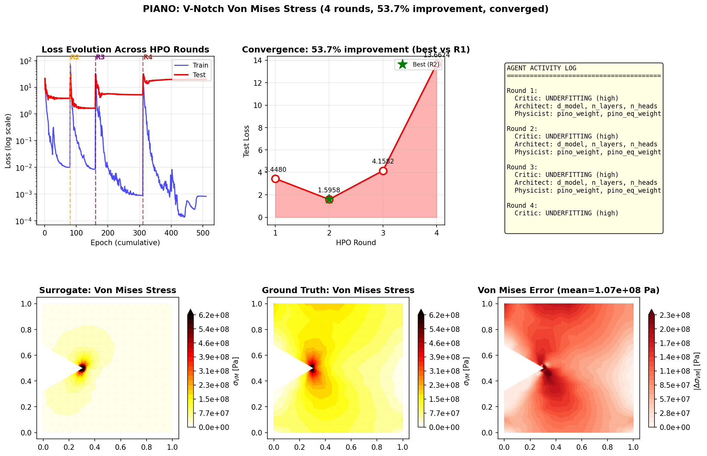

# PIANO

**P**hysics-**I**nformed **A**gentic **N**eural **O**perator

PIANO is a self-improving surrogate framework for computational mechanics. It combines neural operator architectures (Transolver and DeepONet) with physics-informed loss (PINO) and an **autonomous 3-agent HPO system** that diagnoses training issues and proposes fixes — without manual tuning.

---

## Demo Result

V-notch stress prediction: 30 FEM samples, 4 agentic HPO rounds, 53.7% improvement. PINO equilibrium loss active from round 1.



**Bottom row (left to right):**
- **Surrogate** — predicted von Mises stress derived from displacement output `(N, 2)`
- **Ground Truth** — FEM solution (Williams eigenfunction expansion)
- **Error** — Absolute pointwise error (mean: 1.07×10⁸ Pa)

The surrogate captures the 1/√r stress singularity at the notch tip and the stress-free notch faces from 30 training samples. The PINO equilibrium residual (`pino_eq_weight=0.1`) is active throughout and tuned further each round by the Physicist agent.

### Run the Demo

```bash
# Default: 30 samples, 80 epochs/round, 8 rounds (mock LLM)
python tests/test_agentic_sciml.py

# Faster run
python tests/test_agentic_sciml.py --n-samples 30 --epochs 80 --rounds 3

# With real LLM agents (requires ANTHROPIC_API_KEY)
python tests/test_agentic_sciml.py --use-real-llm
```

---

## What Makes PIANO Different?

Traditional neural operators require manual hyperparameter tuning. PIANO uses **LLM-based agents** that automatically diagnose training issues and propose fixes:

```
┌─────────────────────────────────────────────────────────────────────┐
│                     3-AGENT HPO SYSTEM                              │
├─────────────────────────────────────────────────────────────────────┤
│                                                                     │
│                         Train Model                                 │
│                              ↓                                      │
│                    ┌─────────────────┐                              │
│                    │  CRITIC AGENT   │                              │
│                    │  Analyzes loss  │                              │
│                    │  curves, detects│                              │
│                    │  issues via LLM │                              │
│                    └────────┬────────┘                              │
│                             ↓                                       │
│              ┌──────────────┴──────────────┐                        │
│              ↓                              ↓                       │
│    ┌─────────────────┐            ┌─────────────────┐               │
│    │ ARCHITECT AGENT │            │ PHYSICIST AGENT │               │
│    │                 │            │                 │               │
│    │ • arch_type     │            │ • pino_weight   │               │
│    │ • d_model       │            │ • pino_eq_weight│               │
│    │ • n_layers      │            │ • Singularity   │               │
│    │ • learning_rate │            │   handling      │               │
│    │ • dropout       │            │ • PDE residual  │               │
│    │ • trunk_dropout │            │                 │               │
│    └────────┬────────┘            └────────┬────────┘               │
│             └──────────────┬───────────────┘                        │
│                            ↓                                        │
│                     Merge Proposals                                 │
│                            ↓                                        │
│                    Retrain & Repeat                                 │
└─────────────────────────────────────────────────────────────────────┘
```

**Why 3 agents?** Physics-informed learning has two distinct concerns:
- **Architecture tuning** (capacity, optimization, architecture selection, regularisation) — handled by Architect
- **Physics enforcement** (PDE constraints, singularities, PINO weights) — handled by Physicist

Separating these allows each agent to be an expert in its domain. All three agents require a real LLM provider — there is no heuristic fallback.

---

## The Agents

### 1. HyperparameterCriticAgent
**Role:** Training diagnostician (LLM-required)

Analyzes loss curves to detect:
- `OVERFITTING` — train/test loss divergence
- `UNDERFITTING` — both losses high, model not learning
- `SLOW_CONVERGENCE` — gradual improvement but far from optimal
- `LOSS_PLATEAU` — no improvement for many epochs
- `UNSTABLE_TRAINING` — large epoch-to-epoch fluctuations
- `GRADIENT_EXPLOSION` — NaN values detected

Requires `set_llm_provider()` before `analyze_training()` — raises `RuntimeError` otherwise.
Lightweight heuristics (`detect_issues_heuristic`) remain available for gating decisions (e.g. `should_trigger_hpo`), but the full LLM diagnosis is always used for HPO.

### 2. ArchitectAgent
**Role:** Neural network architect

Selects architecture and proposes hyperparameters:

| Concern | Parameters |
|---------|------------|
| Architecture | `arch_type` (transolver \| deeponet), `d_model`, `n_layers`, `n_heads` |
| Optimization | `learning_rate`, `optimizer_type`, `scheduler_type` |
| Regularization | `dropout` (branch), `trunk_dropout` (trunk — independent) |
| Capacity | `slice_num`, `hidden_dim`, `n_basis` |
| Physics | `pino_weight`, `pino_eq_weight` |

**Architecture selection:**
- `transolver` — varied geometry or large datasets (> 200 samples)
- `deeponet` — fixed geometry + small datasets (< 100 samples)

### 3. PhysicistAgent
**Role:** Physics loss specialist

Proposes changes to:
| Category | Parameters |
|----------|------------|
| Energy loss | `pino_weight` (strain energy consistency, needs ground truth) |
| Equilibrium | `pino_eq_weight` (force balance residual, label-free) |

---

## Neural Architectures

### Transolver (default for large datasets)
Physics-Attention transformer operator. Learns mappings over unstructured meshes via sliced attention over geometry-aware tokens.

### DeepONet (selected for small datasets)
Branch-trunk neural operator. Separates parameter dependence from spatial representation:

```
output(x; μ) = Σ_k  branch_k(μ) × trunk_k(x)  + bias
```

- **Branch** encodes *what* — how parameters (E, ν, traction, K_I) modulate the field
- **Trunk** encodes *where* — spatial basis functions over enriched coordinates

**Two independent dropout rates:**
- `dropout` — branch MLP regularisation (keep low; branch just maps parameters to coefficients)
- `trunk_dropout` — trunk MLP regularisation (prevents oscillatory basis function artifacts in the far-field; both are tunable by the Architect agent)

**Singularity-aware trunk coordinates:**
Raw `(x, y)` are enriched with polar features relative to the notch/crack tip:
```
[x, y, r, log(r), sin(θ), cos(θ)]
```
`log(r)` is the key feature since `log(σ) ≈ log(K_I) − 0.5·log(r)` near the tip. `sin/cos(θ)` replaces raw `atan2` to avoid the ±π branch-cut discontinuity that causes swirling artifacts in the far-field.

---

## Physics-Informed Training

### Training Target: Displacement Field
The surrogate predicts nodal **displacement** `(N, 2)` in physical units. Von Mises stress is derived from the predicted displacement at evaluation time via the plane-stress constitutive law — this keeps the output space physics-consistent and enables the PINO loss.

### Tip-Weighted MSE
Nodes near the notch tip get higher loss weight: `w_i = 1 + tip_weight / r_i`, normalized so `mean(w) = 1`. This prevents the model from ignoring the singularity in favour of the smooth far-field.

### PINO Loss
```
L_total = L_MSE + pino_weight × L_energy + pino_eq_weight × L_equilibrium
```

| Term | Formula | Labels needed |
|------|---------|---------------|
| `L_energy` | Strain energy of prediction error: `Σ_e (ε_err^T C ε_err A_e) / Σ A_e` | Yes (displacement GT) |
| `L_equilibrium` | Nodal force residual: `‖Σ_e B_e^T C B_e u_e A_e‖² / N` | No (label-free) |

Both terms use fully differentiable PyTorch `einsum` + `scatter_add_`. Coordinates are always sliced to `(x, y)` before being passed to the physics losses, so enriched 6-feature trunk inputs are handled correctly.

`pino_eq_weight=0.1` is active from round 1 by default. `pino_weight` starts at 0.0 and is enabled by the Physicist agent when the training history warrants it.

### Fracture Mechanics Loss (CrackFractureLoss)
Four additional terms for explicit fracture mechanics:
- **K_I consistency** — least-squares SIF extraction from near-tip displacement
- **Crack face BC** — σ_yy = σ_xy = 0 on crack-face elements
- **Williams residual** — near-tip displacement matches Mode I expansion
- **J-integral** — domain J = K_I²/E (plane stress)

All four terms require displacement `(N, 2)` input. Weights (`ki_weight`, `bc_weight`, `williams_weight`, `j_weight`) are off by default and can be enabled once the surrogate produces physically plausible displacements.

---

## Project Structure

```
piano/
├── surrogate/                   # Neural operator training
│   ├── transolver.py           # Transolver (Physics-Attention)
│   ├── deeponet.py             # DeepONet (Branch-Trunk operator)
│   ├── trainer.py              # Training loop (PINO-enabled, coord slicing)
│   ├── agentic_trainer.py      # 3-agent HPO wrapper
│   ├── ensemble.py             # Ensemble for uncertainty (seed-diverse)
│   ├── pino_loss.py            # PINO elasticity loss (equilibrium + energy)
│   ├── crack_pino_loss.py      # Fracture mechanics loss (K_I, J-integral)
│   └── base.py                 # TransolverConfig, DeepONetConfig, CrackConfig
│
├── agents/                      # LLM-based agents
│   ├── base.py                 # BaseAgent, AgentContext
│   ├── roles/
│   │   ├── hyperparameter_critic.py  # LLM diagnosis (no heuristic fallback)
│   │   ├── architect.py              # Architecture, optimizer, trunk_dropout tuning
│   │   └── physicist.py              # Physics loss tuning
│   └── llm/                    # Providers: Anthropic (Claude 4), OpenAI
│
├── data/                        # Dataset utilities
│   ├── dataset.py              # FEMDataset, FEMSample (with elements field)
│   └── fem_generator.py        # V-notch FEM sample generation (MFEM or synthetic)
│
├── geometry/                    # Mesh generation
│   ├── notch.py                # V-notch geometry + mesh (filters notch interior)
│   └── crack.py                # Edge crack geometry
│
├── mesh/                        # Mesh handling
│   └── mfem_manager.py         # PyMFEM wrapper (get_nodes, get_elements)
│
└── solvers/                     # FEM solvers
    └── mfem_solver.py          # PyMFEM linear-elasticity
```

---

## Configuration

### DeepONetConfig (small datasets, fixed geometry)

| Parameter | Default | Agent-tunable | Description |
|-----------|---------|---------------|-------------|
| `hidden_dim` | 64 | Architect | MLP width for branch and trunk |
| `n_basis` | 32 | Architect | Number of shared spatial basis functions |
| `n_layers` | 3 | Architect | MLP depth |
| `dropout` | 0.0 | Architect | Branch dropout |
| `trunk_dropout` | 0.1 | Architect | Trunk dropout (prevents oscillatory basis artifacts) |
| `learning_rate` | 1e-3 | Architect | Learning rate |
| `optimizer_type` | "adamw" | Architect | Optimizer |
| `scheduler_type` | "cosine" | Architect | LR scheduler |
| `output_dim` | 2 | Fixed | Displacement field (x, y) |

### TransolverConfig (large datasets, varied geometry)

| Parameter | Default | Agent-tunable | Description |
|-----------|---------|---------------|-------------|
| `d_model` | 256 | Architect | Hidden dimension |
| `n_layers` | 6 | Architect | Transformer layers |
| `n_heads` | 8 | Architect | Attention heads (must divide d_model) |
| `slice_num` | 32 | Architect | Physics-attention slices |
| `dropout` | 0.0 | Architect | Dropout rate |
| `learning_rate` | 1e-3 | Architect | Learning rate |
| `pino_weight` | 0.1 | Physicist | Energy-norm loss weight |
| `pino_eq_weight` | 0.1 | Physicist | Equilibrium residual weight |
| `tip_weight` | 0.0 | Fixed | Notch-tip loss amplification |
| `output_dim` | 2 | Fixed | Displacement field (x, y) |

---

## Installation

```bash
git clone https://github.com/your-username/PIANO.git
cd PIANO
pip install -e ".[all]"
pip install pytest-asyncio  # required for async agent tests
```

PyMFEM is required for real FEM data generation. If unavailable, the demo falls back to a Williams eigenfunction synthetic solver automatically.

**LLM provider:** Set `ANTHROPIC_API_KEY` in your environment and pass `--use-real-llm` to use Claude 4 for all three agents. Without it, a `MockLLMProvider` is used for development and testing.

---

## References

- Wu et al. (2024): *Transolver: A Fast Transformer Solver for PDEs on General Geometries*, ICML 2024
- Lu et al. (2021): *Learning Nonlinear Operators via DeepONet*, Nature Machine Intelligence
- Li et al. (2024): *Physics-Informed Neural Operator for Learning Partial Differential Equations*
- Williams (1957): *On the Stress Distribution at the Base of a Stationary Crack*
- [MFEM](https://mfem.org/) — Modular Finite Element Methods library

---

## License

BSD 3-Clause. See [LICENSE](LICENSE) for details.

## Authors

- Hyun-Young Nam (hyun_young_nam@brown.edu)
- Qile Jiang (qile_jiang@brown.edu)
