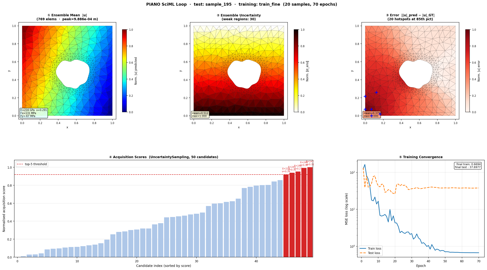
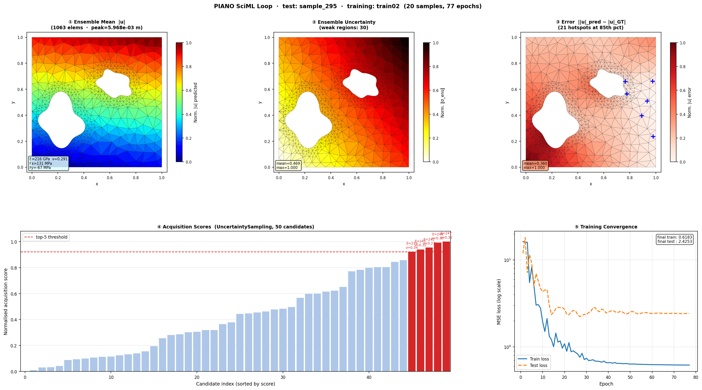
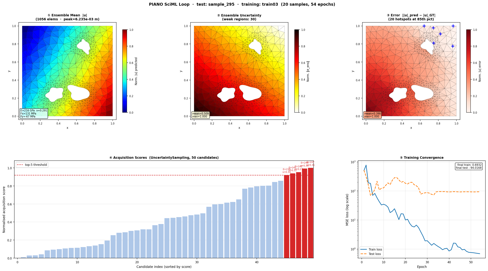

# PIANO

**P**hysics-**I**nformed **A**gentic **N**eural **O**perator

PIANO is a self-improving surrogate framework for computational mechanics. It combines a **Transolver neural operator** with a **PINO (Physics-Informed Neural Operator) loss** and an **autonomous active learning loop** to learn FEM field predictions with minimal ground-truth simulations.

---

## Core Idea

The surrogate improves along two independent axes simultaneously:

1. **Active learning** — ensemble uncertainty identifies where new FEM simulations are most valuable; acquisition functions select the most informative parameter configurations
2. **Physics-informed training** — PINO loss enforces 2D plane-stress equilibrium during training, making the surrogate physically consistent even in low-data regions

```
┌─────────────────────────────────────────────────────────────────────┐
│                         PIANO WORKFLOW                              │
├─────────────────────────────────────────────────────────────────────┤
│                                                                     │
│  1. INITIAL SAMPLING (Latin Hypercube)                              │
│     └─ Diverse initial coverage of parameter space                  │
│                          ↓                                          │
│  2. FEM SIMULATIONS (PyMFEM)                                        │
│     └─ Linear-elasticity PCG solver → displacement, von Mises       │
│                          ↓                                          │
│  ┌──────────────── SELF-IMPROVEMENT LOOP ─────────────────────────┐ │
│  │                                                                │ │
│  │  3. TRAIN Transolver + PINO LOSS                               │ │
│  │     ├─ L_data  = MSE(u_pred, u_true)                           │ │
│  │     ├─ L_eq    = ‖R‖²  (nodal force balance, no labels)        │ │
│  │     └─ L_pino  = W(u_err)/Vol (energy-norm error, with labels) │ │
│  │                          ↓                                     │ │
│  │  4. EVALUATE VIA ENSEMBLE UNCERTAINTY                          │ │
│  │     └─ uncertainty = std across ensemble members               │ │
│  │                          ↓                                     │ │
│  │  5. SELECT INFORMATIVE SAMPLES (acquisition function)          │ │
│  │     └─ Uncertainty / EI / QBC — with diversity filter          │ │
│  │                          ↓                                     │ │
│  │  6. CHECK CONVERGENCE                                          │ │
│  │     ├─ error < threshold → CONVERGED                           │ │
│  │     ├─ no improvement for N steps → PATIENCE_EXHAUSTED         │ │
│  │     └─ budget exhausted → BUDGET_EXHAUSTED                     │ │
│  │                          ↓                                     │ │
│  │  7. RUN NEW FEM SIMULATIONS & LOOP                             │ │
│  └────────────────────────────────────────────────────────────────┘ │
│                          ↓                                          │
│  8. SAVE: Dataset, Surrogate, Metrics                               │
└─────────────────────────────────────────────────────────────────────┘
```

---

## Example Outputs

PIANO trains on three geometry families, each solved with randomised material properties (E, ν) and biaxial loads (Fx, Fy). All panels show displacement magnitude |u| predicted by the 3-member ensemble, trained on 20 FEM samples with PINO loss active.

### Single hole (`train_fine/`)



Plate [0,1]² with one blob-shaped void (local hole refinement, ~800 elements). Stress concentration forms a smooth gradient around the hole. Uncertainty peaks near the hole boundary where the field gradient is steepest.

---

### Double hole (`train02/`)



Two non-overlapping blob holes. The ligament (material bridge between holes) concentrates stress and drives higher uncertainty in the inter-hole region — exactly the region the acquisition function prioritises for the next FEM simulation.

---

### Hole cluster (`train03/`)



3–5 randomly placed blob holes (~1300 elements). Complex multi-hole interaction fields test the surrogate's ability to generalise across topologically varied geometries. Near-boundary holes (30% of samples) add edge-interaction stress patterns to the training distribution.

---

**Panel legend (all figures):**
- **① Ensemble Mean |u|** — normalised displacement magnitude; captures load path and stress concentration geometry
- **② Ensemble Uncertainty** — norm of ensemble std across displacement components; high values identify where more FEM data is needed
- **③ Error Field** — `||u|_pred − |u|_GT|`; blue `+` markers are the top spatial hotspots at the 85th percentile
- **④ Acquisition Scores** — 50 candidate parameter sets sorted by `UncertaintySampling`; red bars (top-5) are the next simulations the orchestrator would request
- **⑤ Training Convergence** — displacement MSE loss vs epoch (log scale); PINO physics loss is active alongside data loss

---

## Key Features

- **Transolver surrogate** — Physics-Attention (slice-attention) neural operator; reduces O(N²) attention to O(S² + NS) for unstructured meshes
- **PINO loss** — two physics terms computed from Delaunay triangulation + vectorized B-matrices:
  - Equilibrium residual `‖R‖²` at mesh nodes (label-free, true PINO)
  - Energy-norm error `W(u_pred − u_true)/Vol` (physics-weighted H1 seminorm)
- **Ensemble active learning** — 5-member ensemble for uncertainty quantification; acquisition functions (Uncertainty, EI, QBC, UCB) drive intelligent sampling
- **PyMFEM FEM ground truth** — real linear-elasticity solver (PCG + Gauss-Seidel), no analytical approximations
- **Agentic orchestration** — LLM-based agents (Claude / GPT-4) for proposal, engineering, evaluation, and debugging roles

---

## Quick Start

### Programmatic API

```python
from piano import AdaptiveOrchestrator, AdaptiveConfig

config = AdaptiveConfig(
    base_mesh_path="meshes/plate_with_hole.mesh",
    output_dir="./output",
    parameter_bounds={
        "delta_R": (-0.5, 0.5),   # hole radius variation
        "E":       (150e9, 250e9), # Young's modulus
        "load":    (80e6, 120e6),  # applied traction (Pa)
    },
    initial_samples=20,
    max_samples=200,
    acquisition_strategy="uncertainty",
    convergence_threshold=0.05,
    n_ensemble=5,
)

orchestrator = AdaptiveOrchestrator(config)
result = orchestrator.run()

print(f"Stopped: {result.stopping_criterion.name}")
print(f"Samples used: {result.total_samples}")
print(f"Error reduction: {result.error_reduction_percent:.1f}%")
```

### Training the Surrogate (CLI)

```bash
# Generate mesh samples
python samples/generate_samples.py --n 200 --output train01

# Train ensemble surrogate
python tests/test_transolver.py \
    --samples-dirs train01 \
    --model-dir outputs/surrogate \
    --epochs 500
```

---

## Installation

```bash
git clone https://github.com/AgenticSciML/PIANO.git
cd PIANO
pip install -e ".[all]"
```

### Dependency groups

| Group | Command | Includes |
|-------|---------|---------|
| Core | `pip install -e .` | numpy, scipy, PyYAML |
| Surrogate | `pip install -e ".[surrogate]"` | + torch, einops |
| FEM solver | `pip install -e ".[mfem]"` | + mfem |
| Full | `pip install -e ".[all]"` | everything + pyvista |

**Prerequisites:** Python 3.9+, PyTorch ≥ 2.0, PyMFEM ≥ 4.6 (for FEM ground truth)

---

## PINO Loss

The physics loss is computed for each training sample using the mesh coordinates and predicted displacement field — no additional FEM solve required.

```python
from piano.surrogate.pino_loss import PINOElasticityLoss

# Instantiated automatically by SurrogateTrainer when pino_weight > 0
loss_fn = PINOElasticityLoss(
    E=1.0,              # dimensionless (trainer normalizes outputs)
    nu=0.3,             # Poisson's ratio — drives constitutive anisotropy
    eq_weight=0.1,      # weight for equilibrium residual (label-free)
    energy_weight=0.1,  # weight for energy-norm error (with labels)
)

# Total training loss per sample:
# L = L_MSE + eq_weight * L_eq + energy_weight * L_energy
```

**How it works:**

1. Delaunay triangulation of mesh nodes (scipy, once per sample, ~1ms)
2. Vectorized B-matrix assembly over all triangles: `B: (M, 3, 6)`, `areas: (M,)`
3. **Equilibrium term** — assemble nodal force residual via `scatter_add_`:
   ```
   R_i = Σ_e (B_e^T C B_e u_pred_e A_e)   →  ‖R‖² / N
   ```
4. **Energy-norm term** — strain energy of prediction error:
   ```
   L_energy = Σ_e (ε_err_e^T C ε_err_e A_e) / Σ_e A_e
   ```

Fully differentiable — gradients flow back through `scatter_add_` and `einsum` to the Transolver weights.

---

## FEM Solver

```python
from piano.mesh.mfem_manager import MFEMManager
from piano.solvers.mfem_solver import MFEMSolver
from piano.solvers.base import (
    PhysicsConfig, PhysicsType, MaterialProperties,
    BoundaryCondition, BoundaryConditionType,
)
import numpy as np, tempfile

manager = MFEMManager("train01/sample_000.mesh")

physics = PhysicsConfig(
    physics_type=PhysicsType.LINEAR_ELASTICITY,
    material=MaterialProperties(E=200e9, nu=0.3),
    boundary_conditions=[
        BoundaryCondition(BoundaryConditionType.SYMMETRY, boundary_id=4, direction=0),
        BoundaryCondition(BoundaryConditionType.SYMMETRY, boundary_id=1, direction=1),
        BoundaryCondition(BoundaryConditionType.TRACTION,  boundary_id=2,
                          value=np.array([100e6, 0.])),
    ],
)

solver = MFEMSolver(order=1)
solver.setup(manager, physics)

with tempfile.TemporaryDirectory() as tmp:
    result = solver.solve(tmp)

vm = result.solution_data['von_mises']
print(f"von Mises: {vm.min()*1e-6:.1f} .. {vm.max()*1e-6:.1f} MPa")
```

**Solver:** Galerkin FEM with `ElasticityIntegrator`, H1 order-1 elements, PCG (500 iters, 1e-12 tol), Gauss-Seidel preconditioner.

---

## Architecture

```
piano/
├── __init__.py                  # Public API
├── cli.py                       # Command-line interface
│
├── surrogate/                   # Neural operator + active learning
│   ├── transolver.py           # Transolver (Physics-Attention neural operator)
│   ├── ensemble.py             # Ensemble wrapper for uncertainty quantification
│   ├── pino_loss.py            # PINO loss (equilibrium residual + energy-norm)
│   ├── trainer.py              # Training workflow (MSE + PINO)
│   ├── evaluator.py            # Uncertainty analysis + acquisition sampling
│   ├── acquisition.py          # Acquisition functions (Uncertainty, EI, QBC, UCB)
│   ├── error_analysis.py       # Spatial error decomposition
│   └── base.py                 # TransolverConfig, SurrogateModel interface
│
├── orchestration/               # Workflow control
│   ├── adaptive.py             # AdaptiveOrchestrator (active learning loop)
│   └── metrics.py              # Learning efficiency tracking
│
├── data/                        # Dataset management
│   ├── dataset.py              # FEMSample, FEMDataset
│   └── loader.py               # Data loaders
│
├── mesh/                        # Mesh handling
│   ├── base.py                 # MeshManager interface
│   └── mfem_manager.py         # MFEM mesh wrapper
│
├── solvers/                     # FEM solvers
│   ├── base.py                 # SolverInterface, PhysicsConfig, BoundaryCondition
│   └── mfem_solver.py          # PyMFEM linear-elasticity + heat-transfer
│
├── evaluation/                  # Mesh quality metrics
└── agents/                      # LLM-based agentic roles (optional)
    ├── roles/                   # Engineer, Evaluator, Debugger, Proposer
    ├── prompts/                 # System prompts
    └── llm/                    # Claude / GPT-4 providers
```

---

## Configuration Reference

### `TransolverConfig` (physics-informed training)

| Parameter | Default | Description |
|-----------|---------|-------------|
| `pino_weight` | `0.1` | Weight for energy-norm error term |
| `pino_eq_weight` | `0.1` | Weight for equilibrium residual term |
| `pino_E` | `1.0` | Young's modulus for PINO (dimensionless with normalized outputs) |
| `pino_nu` | `0.3` | Poisson's ratio for PINO constitutive law |
| `epochs` | `1000` | Max training epochs |
| `patience` | `100` | Early stopping patience |
| `batch_size` | `32` | Gradient accumulation batch size |
| `d_model` | `256` | Hidden dimension |
| `n_layers` | `6` | Transolver layers |
| `slice_num` | `32` | Physics-attention slices S |
| `learning_rate` | `1e-3` | AdamW learning rate |

### `AdaptiveConfig` (active learning loop)

| Parameter | Default | Description |
|-----------|---------|-------------|
| `base_mesh_path` | required | Path to MFEM mesh |
| `output_dir` | required | Output directory |
| `parameter_bounds` | `{"delta_R": (-0.5, 0.5)}` | Bounds per parameter |
| `initial_samples` | `20` | Initial LHS samples |
| `max_samples` | `200` | Hard budget limit |
| `convergence_threshold` | `0.05` | Error threshold to stop |
| `patience` | `3` | Iterations without improvement |
| `n_ensemble` | `5` | Ensemble size for UQ |
| `acquisition_strategy` | `"uncertainty"` | Acquisition function |

---

## API Reference

```python
# Core
from piano import AdaptiveOrchestrator, AdaptiveConfig, AdaptiveResult
from piano import MFEMManager, MFEMSolver, PhysicsConfig, PhysicsType, MaterialProperties
from piano import FEMDataset, FEMSample, DatasetConfig

# Surrogate
from piano.surrogate.pino_loss import PINOElasticityLoss
from piano.surrogate.trainer import SurrogateTrainer
from piano.surrogate.evaluator import SurrogateEvaluator
from piano.surrogate.acquisition import get_acquisition_function
from piano.surrogate.base import TransolverConfig

# Metrics
from piano.orchestration.metrics import ActiveLearningMetrics
```

---

## Stopping Criteria

| Criterion | Condition |
|-----------|-----------|
| `CONVERGED` | Test error < `convergence_threshold` |
| `PATIENCE_EXHAUSTED` | No improvement for `patience` iterations |
| `BUDGET_EXHAUSTED` | Total samples ≥ `max_samples` |
| `MAX_ITERATIONS` | Loop iterations ≥ limit |
| `LOW_UNCERTAINTY` | Mean ensemble uncertainty < threshold |
| `DIMINISHING_RETURNS` | Sample efficiency dropping consistently |

---

## References

- Wu et al. (2024): *Transolver: A Fast Transformer Solver for PDEs on General Geometries*, ICML 2024
- Li et al. (2024): *Physics-Informed Neural Operator for Learning Partial Differential Equations*, ICLR 2024
- Settles (2009): *Active Learning Literature Survey*
- [MFEM](https://mfem.org/) — Modular Finite Element Methods library
- [PyMFEM](https://github.com/mfem/PyMFEM) — Python wrapper for MFEM

---

## License

BSD 3-Clause. See [LICENSE](LICENSE) for details.

## Authors

- Hyun-Young Nam (hyun_young_nam@brown.edu)
- Qile Jiang (qile_jiang@brown.edu)
